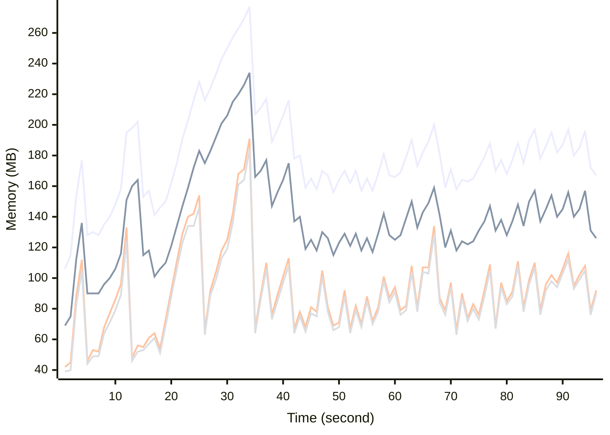

# Benchmark Report
> Generated by [`@nestia/benchmark`](https://github.com/samchon/nestia)

  - Specifications
    - CPU: AMD Ryzen 9 7940HS w/ Radeon 780M Graphics     
    - RAM: 31 GB
    - NodeJS Version: v20.10.0
    - Backend Server: 1 core / 1 thread
  - Arguments
    - Count: 40,000
    - Threads: 4
    - Simultaneous: 32
  - Time
    - Start: 2024-07-26T05:37:51.497Z
    - Complete: 2024-07-26T05:39:34.390Z
    - Elapsed: 102,893 ms

Type | Count | Success | Mean. | Stdev. | Minimum | Maximum
----|----|----|----|----|----|----
Total | 41,383 | 41,383 | 74.78 | 73.58 | 5 | 523

> Unit: milliseconds

## Memory Consumptions

> - 🟦 Resident Set Size
> - 🟢 Heap Total
> - 🔴 Heap Used + External
> - 🟡 Heap Used Only

## Endpoints
Type | Count | Success | Mean. | Stdev. | Minimum | Maximum
----|----|----|----|----|----|----
PATCH /bbs/articles/:section | 6,492 | 6,492 | 104.93 | 75.27 | 6 | 523
GET /bbs/articles/:section/:id | 601 | 601 | 79.59 | 73.28 | 6 | 493
POST /bbs/articles/:section | 33,968 | 33,968 | 69.03 | 71.97 | 5 | 503
PUT /bbs/articles/:section/:id | 322 | 322 | 63.94 | 56.27 | 7 | 371

> Unit: milliseconds

## Failures
Method | Path | Count | Failures
-------|------|-------|----------