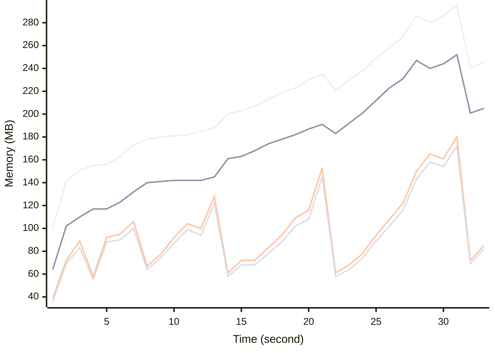

# Benchmark Report
> Generated by [`@nestia/benchmark`](https://github.com/samchon/nestia)

  - Specifications
    - CPU: AMD Ryzen 9 7940HS w/ Radeon 780M Graphics     
    - RAM: 31 GB
    - NodeJS Version: v20.10.0
    - Backend Server: 1 core / 1 thread
  - Arguments
    - Count: 20,000
    - Threads: 4
    - Simultaneous: 32
  - Time
    - Start: 2024-07-26T05:14:20.547Z
    - Complete: 2024-07-26T05:14:54.855Z
    - Elapsed: 34,308 ms

Type | Count | Success | Mean. | Stdev. | Minimum | Maximum
----|----|----|----|----|----|----
Total | 22,298 | 22,298 | 45.03 | 48.68 | 3 | 305

> Unit: milliseconds

## Memory Consumptions

> - 🟦 Resident Set Size
> - 🟢 Heap Total
> - 🔴 Heap Used + External
> - 🟡 Heap Used Only

## Endpoints
Type | Count | Success | Mean. | Stdev. | Minimum | Maximum
----|----|----|----|----|----|----
PATCH /bbs/articles/:section | 3,603 | 3,603 | 80.72 | 55.29 | 3 | 305
GET /bbs/articles/:section/:id | 386 | 386 | 56.66 | 46.34 | 7 | 249
PUT /bbs/articles/:section/:id | 142 | 142 | 52.45 | 48.61 | 7 | 242
POST /bbs/articles/:section | 18,167 | 18,167 | 37.64 | 43.91 | 3 | 305

> Unit: milliseconds

## Failures
Method | Path | Count | Failures
-------|------|-------|----------