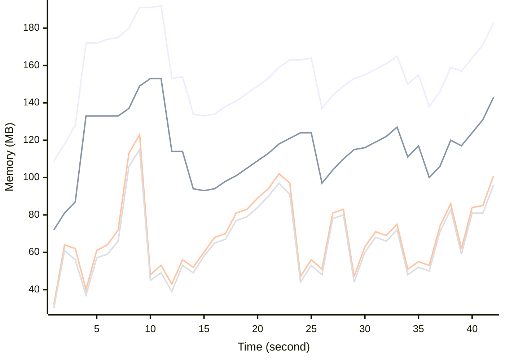

# Benchmark Report
> Generated by [`@nestia/benchmark`](https://github.com/samchon/nestia)

  - Specifications
    - CPU: AMD Ryzen 9 7940HS w/ Radeon 780M Graphics     
    - RAM: 31 GB
    - NodeJS Version: v20.10.0
    - Backend Server: 1 core / 1 thread
  - Arguments
    - Count: 20,000
    - Threads: 4
    - Simultaneous: 32
  - Time
    - Start: 2024-07-26T04:53:22.534Z
    - Complete: 2024-07-26T04:54:07.467Z
    - Elapsed: 44,933 ms

Type | Count | Success | Mean. | Stdev. | Minimum | Maximum
----|----|----|----|----|----|----
Total | 21,984 | 21,984 | 60.68 | 73.19 | 4 | 571

> Unit: milliseconds

## Memory Usage

 - ■ Resident Set Size
 - ■ Heap Total
 - ■ Heap Used + External
 - ■ Heap Used Only

## Endpoints
Type | Count | Success | Mean. | Stdev. | Minimum | Maximum
----|----|----|----|----|----|----
PATCH /bbs/articles/:section | 3,521 | 3,521 | 106.1 | 84.37 | 4 | 571
PUT /bbs/articles/:section/:id | 206 | 206 | 67.02 | 73.95 | 8 | 443
GET /bbs/articles/:section/:id | 299 | 299 | 65.42 | 69.95 | 7 | 570
POST /bbs/articles/:section | 17,958 | 17,958 | 51.62 | 67.31 | 4 | 570

> Unit: milliseconds

## Failures
Method | Path | Count | Failures
-------|------|-------|----------