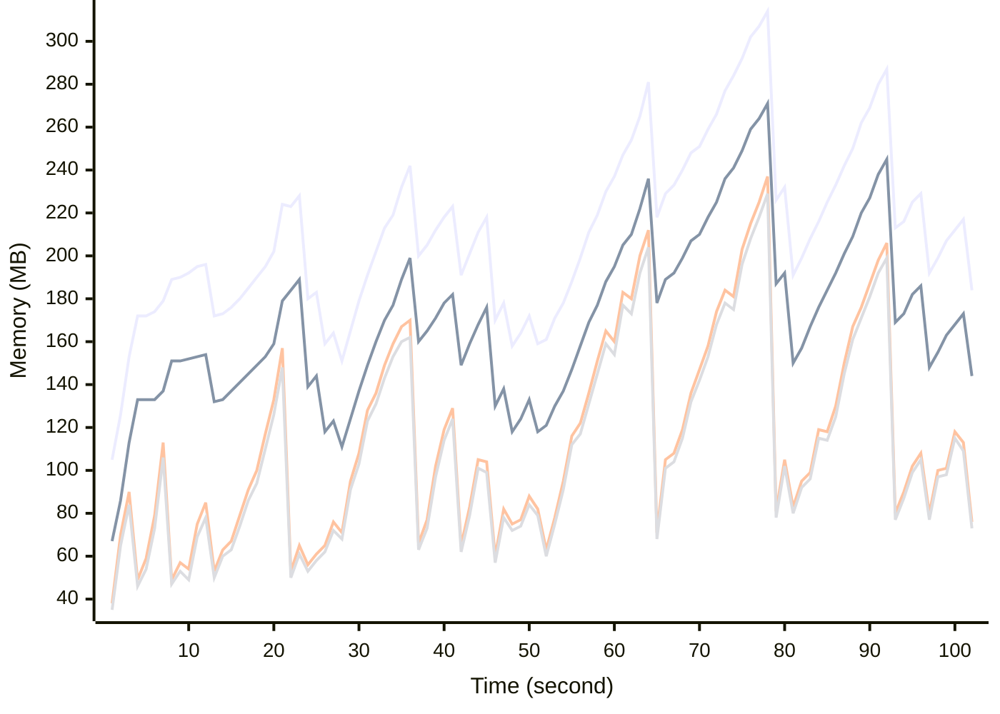

# Benchmark Report
> Generated by [`@nestia/benchmark`](https://github.com/samchon/nestia)

  - Specifications
    - CPU: AMD Ryzen 9 7940HS w/ Radeon 780M Graphics     
    - RAM: 31 GB
    - NodeJS Version: v20.10.0
    - Backend Server: 1 core / 1 thread
  - Arguments
    - Count: 40,000
    - Threads: 4
    - Simultaneous: 32
  - Time
    - Start: 2024-07-26T05:21:01.375Z
    - Complete: 2024-07-26T05:22:51.428Z
    - Elapsed: 110,053 ms

Type | Count | Success | Mean. | Stdev. | Minimum | Maximum
----|----|----|----|----|----|----
Total | 41,996 | 41,996 | 79.2 | 77.63 | 3 | 475

> Unit: milliseconds

## Memory Consumptions

> - 🟦 Resident Set Size
> - 🟢 Heap Total
> - 🔴 Heap Used + External
> - 🟡 Heap Used Only

## Endpoints
Type | Count | Success | Mean. | Stdev. | Minimum | Maximum
----|----|----|----|----|----|----
PATCH /bbs/articles/:section | 6,734 | 6,734 | 117.53 | 80.23 | 6 | 475
PUT /bbs/articles/:section/:id | 324 | 324 | 83.89 | 80.42 | 7 | 384
GET /bbs/articles/:section/:id | 657 | 657 | 78 | 73.83 | 6 | 371
POST /bbs/articles/:section | 34,281 | 34,281 | 71.65 | 74.88 | 3 | 475

> Unit: milliseconds

## Failures
Method | Path | Count | Failures
-------|------|-------|----------