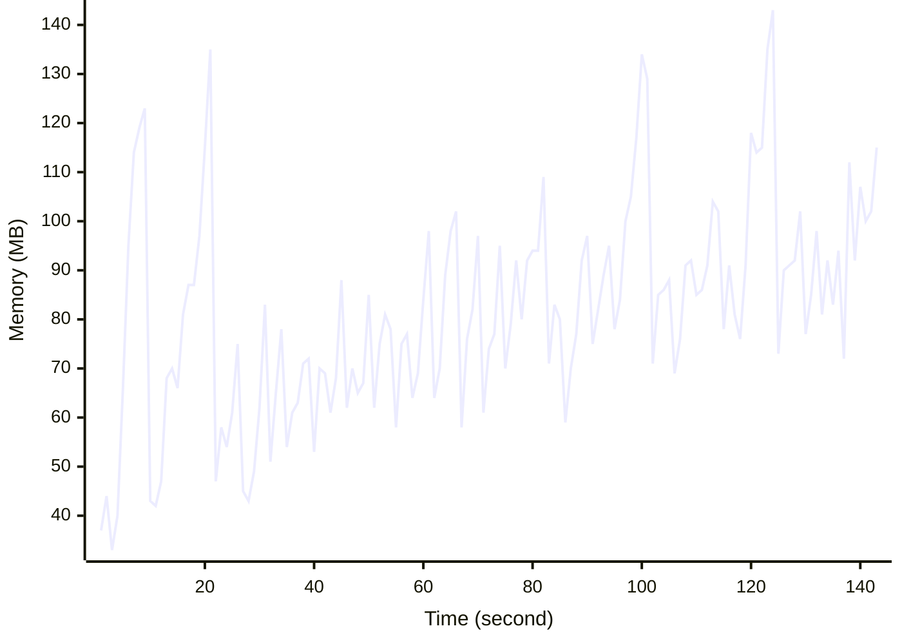

# Benchmark Report
> Generated by [`@nestia/benchmark`](https://github.com/samchon/nestia)

  - Specifications
    - CPU: AMD Ryzen 9 7940HS w/ Radeon 780M Graphics     
    - RAM: 31 GB
    - NodeJS Version: v20.10.0
    - Backend Server: 1 core / 1 thread
  - Arguments
    - Count: 40,000
    - Threads: 4
    - Simultaneous: 32
  - Time
    - Start: 2024-07-25T19:14:00.253Z
    - Complete: 2024-07-25T19:16:37.125Z
    - Elapsed: 156,872 ms

Type | Count | Success | Mean. | Stdev. | Minimum | Maximum
----|----|----|----|----|----|----
Total | 41,226 | 41,226 | 114 | 109.72 | 8 | 998

> Unit: milliseconds

## Memory Usage

## Endpoints
Type | Count | Success | Mean. | Stdev. | Minimum | Maximum
----|----|----|----|----|----|----
PATCH /bbs/articles/:section | 6,703 | 6,703 | 167.16 | 125.5 | 8 | 996
PUT /bbs/articles/:section/:id | 326 | 326 | 117.86 | 101.2 | 11 | 546
GET /bbs/articles/:section/:id | 680 | 680 | 110.42 | 93.49 | 10 | 579
POST /bbs/articles/:section | 33,517 | 33,517 | 103.4 | 103.45 | 8 | 998

> Unit: milliseconds

## Failures
Method | Path | Count | Failures
-------|------|-------|----------