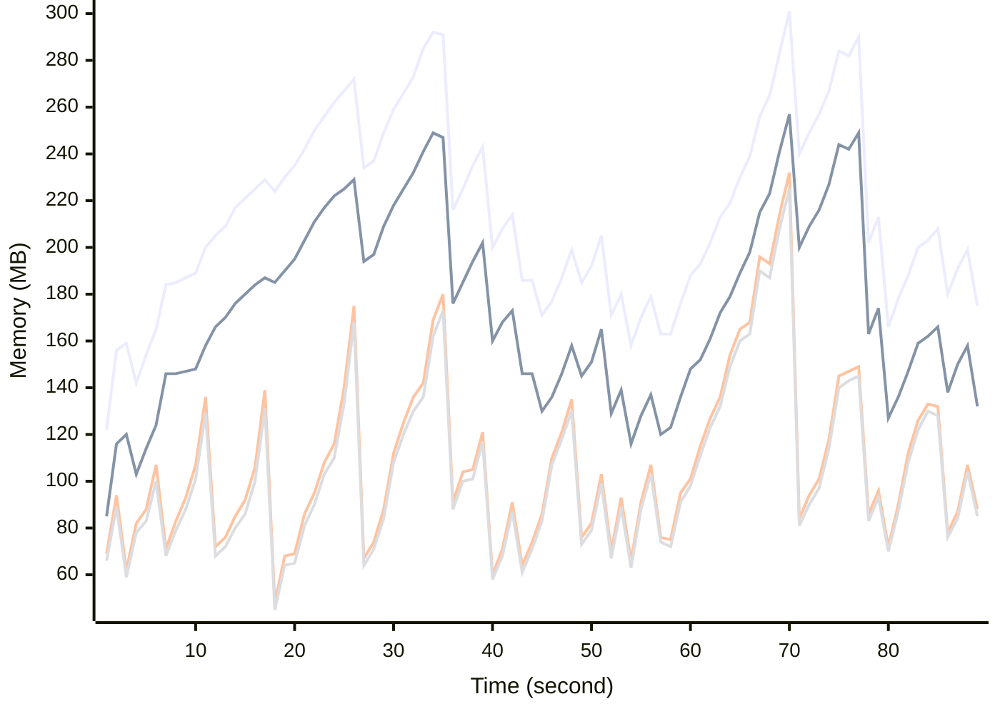

# Benchmark Report
> Generated by [`@nestia/benchmark`](https://github.com/samchon/nestia)

  - Specifications
    - CPU: AMD Ryzen 9 7940HS w/ Radeon 780M Graphics     
    - RAM: 31 GB
    - NodeJS Version: v20.10.0
    - Backend Server: 1 core / 1 thread
  - Arguments
    - Count: 40,000
    - Threads: 4
    - Simultaneous: 32
  - Time
    - Start: 2024-10-29T19:14:35.941Z
    - Complete: 2024-10-29T19:16:11.418Z
    - Elapsed: 95,477 ms

Type | Count | Success | Mean. | Stdev. | Minimum | Maximum
----|----|----|----|----|----|----
Total | 41,586 | 41,586 | 69.24 | 73.05 | 5 | 546

> Unit: milliseconds

## Memory Consumptions

> - 🟦 Resident Set Size
> - 🟢 Heap Total
> - 🔴 Heap Used + External
> - 🟡 Heap Used Only

## Endpoints
Type | Count | Success | Mean. | Stdev. | Minimum | Maximum
----|----|----|----|----|----|----
PATCH /bbs/articles/:section | 6,439 | 6,439 | 108.37 | 76.56 | 6 | 546
PUT /bbs/articles/:section/:id | 380 | 380 | 78.52 | 69.03 | 6 | 296
GET /bbs/articles/:section/:id | 917 | 917 | 77.65 | 69.84 | 6 | 463
DELETE /bbs/articles/:section/:id | 201 | 201 | 73.89 | 63.55 | 7 | 307
POST /bbs/articles/:section | 33,649 | 33,649 | 61.39 | 70.04 | 5 | 546

> Unit: milliseconds

## Failures
Method | Path | Count | Failures
-------|------|-------|----------